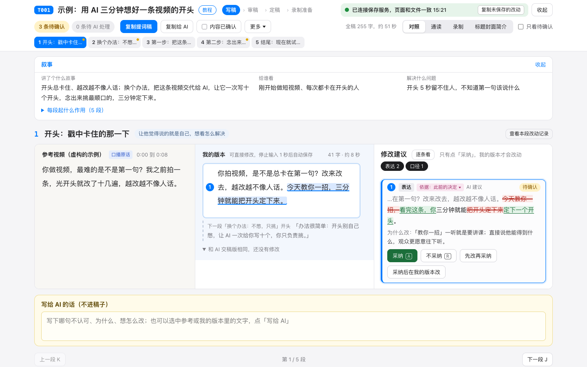
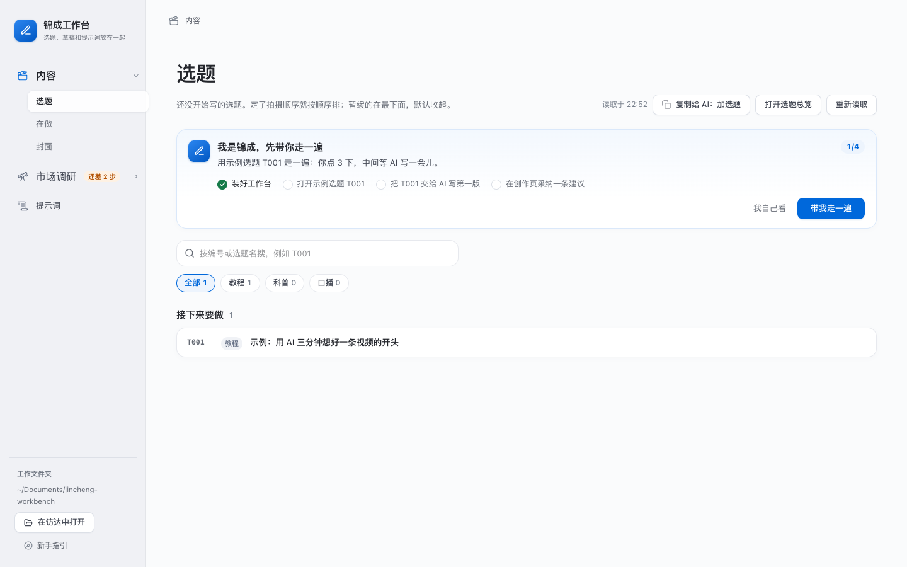
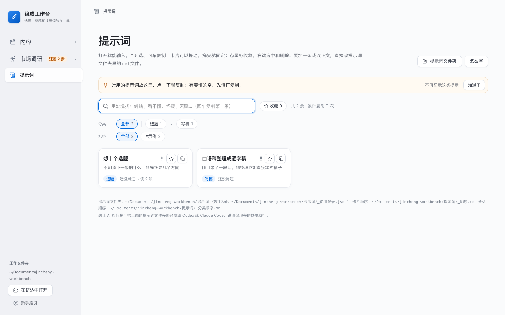
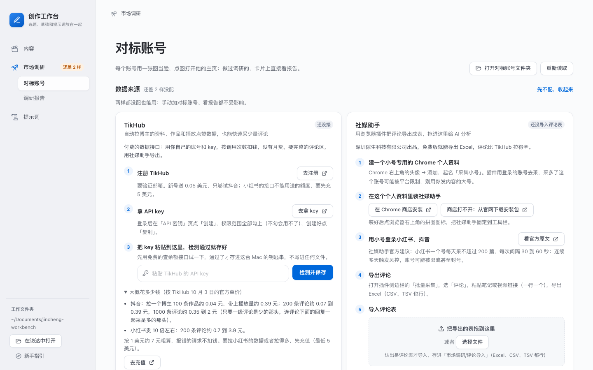

# 锦成工作台

让 AI 照你自己的写法，陪你把短视频从选题写到定稿。装在你自己的 Mac 上，打开浏览器就能用。



- **AI 改稿，你说了算**：AI 写好第一版，做成「创作页」。每条修改建议贴着要改的那一句，你点「采纳」才换进稿子；你自己改的字，停笔 1 秒就存回文件。
- **越写越像你**：怎么写稿，写在工作文件夹里几页 Markdown 的「写稿方法」里。先放了一份默认的，你改了，AI 下次就照你的写。
- **做功课不费劲**：把对标博主加进来、分析一条视频的评论区、看一个博主最近什么最火，跟 AI 说一句就行，报告第一屏就是能拍的选题。
- **封面也交给 AI**：拆对标博主的封面风格（贴主页链接，或者拖几张封面图进来），用你自己的照片照这个风格一次出一批；在 Codex 里点开图挑一张，在图上标出要改的地方让它改。
- **东西都在你电脑上**：选题、稿子、提示词都是普通文件，不用注册账号，不上传你的数据。

配套三个 Skill（写稿、调研、封面），装进 Codex 或 Claude Code 就能用。第一次打开有新手指引，用一条示例选题带你亲手走通一遍。

## 给谁用

- 做口播、教程、知识类短视频，想把选题和稿子管起来的人。
- 平时就用 Codex 或 Claude Code 这类 AI 工具，想让 AI 照你自己的写法陪你改稿的人。

## 能做什么

### 选题和稿子



「内容」在左边菜单里点一下展开，下面有「选题」「在做」「封面」三项（封面见下面「封面」一节）：

- **选题**：还没开始写的选题。定了拍摄顺序就按顺序排，往后推的收进「暂缓」。想加新的，点「复制给 AI：加选题」，粘贴给 Codex 或 Claude Code，在后面写上想做的选题发出去，一条或几条都行：AI 编好号、加进选题总览和选题库，切回来就看到了。
- **在做**：正在写的、录完还没发的、已经做完的。有创作页的点「打开创作页」，没有的点「接着写」，用默认程序打开你最近改的那份稿子。
- 点开一条是详情：做到哪一步、哪里对不上（比如选题卡和总览写的状态不一样）、草稿文件夹里有哪些稿子（定稿和提词器版可以一键复制全文）。没有草稿文件夹时，一个按钮就建好并在访达里打开。

规矩很简单：每条选题一个编号（T001 起），选题总览一张表，每条选题一张选题卡，每条内容一个草稿文件夹。第一次启动会在 `~/Documents/jincheng-workbench/` 建好这些文件夹，里面带一条示例选题 T001（草稿文件夹里放好了一份虚构的参考视频逐字稿和拆解）、两条示例提示词、一个「写稿方法」文件夹，还有一份给 AI 看的说明（AGENTS.md / CLAUDE.md），AI 照它找东西、放东西。想自己动手也行，选题总览和选题卡都是普通的 Markdown 文件。

### 创作页

第一版逐字稿写好后，AI 用写稿 Skill 把它做成一个网页（最上面那张截图），放在这条内容的草稿文件夹里：

- 左边是参考视频的原话，中间「我的版本」是你的稿，右边一列是 AI 的修改建议。每条建议贴着要改的那句话，点「采纳」才换进你的稿，不认可就点「不采纳」。
- 你在「我的版本」里改的字，停笔 1 秒自动存回文件，AI 直接读得到；哪句不认可，选中它写给 AI。改完跟 AI 说「改完了」，它读回你的改动，逐条回复，再提新建议。
- 内容确认以后，AI 出标题、封面文字和简介的候选，也放在这个页面上。

还没有创作页时，详情页上就是交给 AI 的那一句话，点一下就复制，粘贴给 Codex 或 Claude Code 发出去就行，在哪个对话里发都可以：AI 会自己找到你的工作文件夹，工作台或 Skill 没装好的先装好，要你输密码、点允许时会提醒你。

### 提示词



常用提示词一条一张卡：按「什么时候用」搜索，复制前先填好要填的地方，拖动卡片排顺序，点星标收藏，用了几次一目了然。每条提示词就是工作文件夹里的一个 md 文件，子文件夹就是分类。

### 市场调研



写视频前的功课放在这一栏：

- **对标账号**：一面图片墙，图当脸，扫一眼就认出是谁，点图打开他的主页；做过调研的账号，卡上直接看报告。可以在页面上加，也可以点「复制给 AI 的话」交给 AI 加。
- **调研报告**：AI 做好的评论洞察、视频拆解、账号研究，按类型筛，点开在工作台里看。上面写着每种调研还缺什么、接好要几分钟、大概花多少钱。
- **数据来源**：TikHub 和社媒助手，两样都是第三方的，按需接，见下面「TikHub 和社媒助手」。两样都没接也能手动加对标账号、看报告。

### 封面

「内容」栏的「封面」页管风格和照片，每条选题的页面里出一批。拆风格、出图、挑和改都交给 AI：按钮点了直接在 Codex 桌面版里新开一个对话，要说的话已经填好；用别的 AI 工具的，点旁边的「复制给 AI」。

- **风格**：拆过的风格都列在这里，能看能点原图对照的拆解、设成默认、改默认参考哪几张构图。拆一个新风格有三种办法：对标账号里点一下；贴博主的主页链接（抖音、小红书用 TikHub 拉他最近 20 张封面）；把几张封面图拖进来（哪个平台的都行，不花钱；同一种风格放 3 张以上，10 张左右最好）。还没拆的对标账号可以一次全拆。
- **我的照片**：放一张或几张你的照片，AI 照着它把封面上的人换成你。
- **我的封面**：每条内容出过的封面，按内容或者按风格看，也能只看视频的或者文章的。

每条选题的页面里有一块「封面」：选好照哪个风格、参考哪几张构图、封面上写什么字（默认带创作页里定好的）、尺寸（视频和小红书图文用竖版 3:4，公众号头图用横版 2.35:1，还有方形 1:1）、出几张（默认 5 张），点「在 Codex 里出一批封面」。Codex 一张一张出图，出一张这里亮一张；Claude Code 不能直接出图，会把每张的生图提示词写好，这里能一键复制。

挑和改在 Codex 里做：点开一张生成的图，切到「Canvas」能看到这一批；要改哪张，用「Comment」在图上标出来、写怎么改，发给它，改出来的存成新的一张；定了用哪张，跟它说「就用 03」，它存成草稿文件夹里的「封面-选定」。

### 三个 Skill

仓库里带三个 Skill，安装时 AI 会装进这台 Mac 上的 Codex（`~/.codex/skills/`）和 Claude Code（`~/.claude/skills/`），两个都装了的两边都装。

**写稿 Skill**（`skills/jincheng-workbench-write/`）：在 AI 工具里说「用写稿 Skill 帮我写 T001」，AI 先读你工作文件夹里的「写稿方法」，和你定好讲什么、给谁看，写出第一版逐字稿，再做成创作页陪你改，内容确认后出标题、封面文字和简介的候选。它也管加选题：编号、加在选题总览哪一格、选题卡，都由仓库里的 `scripts/add-topic.mjs` 写，不会编错号。

写稿方法不写死在 Skill 里：它是工作文件夹里的几个 Markdown 文件（写稿流程、选题卡怎么写、拆参考、定叙事、口播写法、改稿建议怎么给、你的判断库），先放了一份默认写法，你改了，下次就按新的来。每条内容定稿后，AI 把你这次的改动和取舍整理成几条判断给你过目，你同意的记进判断库，越用越懂你。

**调研 Skill**（`skills/jincheng-workbench-research/`）：「市场调研」页上每种调研都有「复制给 AI 的话」，粘贴给 AI，在后面贴上视频或主页链接发出去就行。它做四件事：

- 加对标账号：拉博主资料和最近作品，在「市场调研/对标账号」里建档案。
- 评论洞察：读完一条视频的评论，按需求、痛点、疑问、反馈归类，出一份报告，第一屏就是结论和能直接拍的选题，往下是每类的原话和条数、评论的都是谁、样本够不够。评论从你用社媒助手导出的表里读；没有表时，也可以用 TikHub 先采一部分。
- 视频拆解：按你「写稿方法」里拆参考的写法拆一条视频（开头怎么抓人、怎么往下讲、能借什么），出一份报告；说了是给哪条选题拆的，也存进那条选题草稿文件夹的「参考拆解.md」。
- 账号研究：找出一个博主明显比他平时火的几条，判断标准写在报告里。

**封面 Skill**（`skills/jincheng-workbench-cover/`）：拆封面 VI（对标博主的，或者你放进来的几张图）、给一条选题出一批封面、按你在 Codex 图上写的评论改一张、记下你定了用哪张，做法照上面「封面」。出图用 Codex 自带的生图，一张一张存进这条内容草稿文件夹里的「封面候选」，登记进生成记录；照片、风格、编号这些都由它的脚本读写，不会弄错。

装好以后，在 AI 里直接说「帮我分析这条视频的评论区：链接」「看看这个博主最近什么最火」也行。

要用 TikHub 花钱时，AI 先按官方单价估算，超过默认上限先问你。

### 新手指引

第一次打开，「内容」页顶部有一张卡，用示例选题 T001 带你走一遍：你点 3 下，中间把复制的那句话粘贴给 Codex 或 Claude Code 发出去（这台 Mac 上装了的，引导里还有一键打开的按钮，话已经填好），等 AI 写第一版，最后在创作页采纳一条建议，清单随进度打勾。不想走就点「我自己看」，左下角「新手指引」随时重看。第一次进「在做」「提示词」「市场调研」时还会轻轻提一句，能一键关掉。

## 怎么装

把下面这句复制给 Codex 或 Claude Code 发出去（Codex 和 Claude Code 都行，在哪个对话里发都可以）：

> 照 https://github.com/jincheng2026/jincheng-workbench 里的 docs/给AI的安装说明.md，把锦成工作台装好，在浏览器里打开给我看。已经装过的话，就更新到最新再打开。缺什么直接装，要我输密码或者点允许的时候提醒我。

AI 会自己看你的电脑缺什么、装好，最后在浏览器里打开工作台，告诉你接下来怎么用。以后电脑重启了、或者想更新到新版本，把同一句话再发一次就行。安装说明是写给 AI 的，一步只做一件事，每步都有检查；也可以自己照着做：[docs/给AI的安装说明.md](docs/给AI的安装说明.md)。

请用 `git clone` 下载，不要在网页上下载压缩包：压缩包没有 git 记录，以后没法更新。

## 需要什么

- Apple 芯片（M1 及以后）的 Mac。Intel 芯片的 Mac 和 Windows 没有测过，不保证能用。
- Node.js 24 或更新的版本。
- pnpm（版本固定为 12.8.1，Node 自带的 corepack 会自动用这个版本）。
- Python 3.8 或更新的版本（创作页的保存服务和三个 Skill 的脚本用，只用 Python 自带的模块）。装了 macOS 的「命令行开发者工具」就有，装 Git 时多半已经装了。
- Codex 或 Claude Code：写稿、调研、出封面是 AI 照着三个 Skill 做的，工作台本身不带 AI。出封面的图要用 Codex（它自带生图）；用 Claude Code 的，AI 会把生图提示词写好。
- 安装依赖时要能连上 npm 的软件源；装好以后，工作台自己不需要联网。

## 平时怎么用

工作台装好后在后台运行，关掉终端、关掉 AI 的对话都不会停，浏览器里打开 AI 告诉你的地址就行（默认 http://127.0.0.1:18879）。创作页的保存服务也一起运行（默认端口 18977）。

电脑重启以后、或者想更新到新版本：把上面「怎么装」那句话再发给 AI 一次，它会更新到最新、启动、打开。也可以自己在终端里运行：

```bash
cd ~/jincheng-workbench
pnpm start --background
```

要停掉：在同一个文件夹里运行 `pnpm stop`。

## 数据都在你的电脑上

| 是什么 | 在哪 |
| --- | --- |
| 你的选题、草稿、写稿方法、提示词、市场调研 | `~/Documents/jincheng-workbench/`（工作文件夹，可以在设置里换） |
| 创作页 | 每条内容的草稿文件夹里，`T001_创作页.html`；自动备份、改动记录在工作文件夹里以 `.jc-` 开头的隐藏文件夹 |
| 对标账号、调研报告、导入的评论表 | 工作文件夹里的「市场调研」，三个文件夹放什么写在那一层的 `README.md` 里 |
| TikHub 的 key | 这台 Mac 的登录钥匙串（服务名 `tikhub-api`，账户名 `tikhub`），不在任何文件里 |
| 设置 | `~/Library/Application Support/jincheng-workbench/config.json` |
| 运行日志 | `~/Library/Logs/jincheng-workbench/workbench.log` |

工作台和创作页的保存服务都只在本机（127.0.0.1）上开服务，别的电脑访问不到；不上传任何数据，也关掉了 Next.js 的使用统计。工作台自己只在你接 TikHub 时（点「检测并保存」）和接好以后连 TikHub：用你的 key 查账户余额（免费的接口），再查一下接口单价，不往外发你的文件。设置能改什么见 [docs/配置说明.md](docs/配置说明.md)。

## TikHub 和社媒助手

市场调研要的数据来自两样第三方的东西，按需接，用不用由你决定：

- **[TikHub](https://tikhub.io)**：付费的数据接口，用你自己的账号和 key，按调用次数扣钱（抖音一次约 0.001 美元，小红书贵 10 倍左右）。适合批量拉博主的资料、作品和数据，也能快速采少量评论。key 在「市场调研」页上粘贴，检测通过才存进这台 Mac 的钥匙串。
- **[社媒助手](https://socialext.com/download)**：浏览器插件，把评论导出成表，免费版就能批量导出，导出的表拖进「市场调研」页就行。要完整的评论区就用它：TikHub 拉抖音评论时翻页会重复，拿到的比平台上显示的少。插件用你在浏览器里登录的账号去采，所以要用小号。

两样都是第三方的服务和插件，费用和风险由你自己评估：抖音、小红书的用户协议都限制自动抓取，账号被限制的风险在使用的人身上。工作台本身不抓取任何平台：它只读你导出的表；拉数据是调研 Skill 在你的电脑上、用你自己的 key 做的，超过默认的花钱上限会先问你。

## 这一版没有的

- 今天页、任务看板，以及已发布内容的播放点赞数据，这一版都没有。
- 没有开机自动启动：电脑重启以后，把安装那句话再发给 AI，或者在终端运行 `pnpm start --background`。
- 只有浅色界面；只在 Apple 芯片的 Mac 上测过。

## 给开发者

- 接口是 `server.mjs` 和 `lib/`，只用 Node 24 自带的模块；界面在 `ui/`，用 Next.js。
- 创作页在 `creation-page/`：保存服务、生成和读改页面的脚本只用 Python 3 自带的模块，页面模板是不依赖网络的原生 JavaScript。数据格式见 `creation-page/schema/creation-page.md`。
- `pnpm test` 跑测试（包括创作页和调研 Skill 的 Python 测试），`pnpm test:browser` 用 Chrome 跑创作页和新手指引的浏览器测试（新手指引那组要 Python 的 playwright），`pnpm typecheck` 查界面类型，`pnpm build` 编译界面，`pnpm check:public` 公开前自查密钥、本机路径和截图里的元数据。
- 为什么这么设计、改代码要守的规矩：[docs/开发记录.md](docs/开发记录.md) 和 [AGENTS.md](AGENTS.md)。
- 名字集中写在 `brand.json`，改名用 `node scripts/rename.mjs`，一条命令改完。

## 作者

锦成。这个仓库是从他自己做内容用的工作台里整理出来的公开版。

- 抖音：何锦成本人
- 小红书：何锦成

## 许可证和致谢

MIT，见 [LICENSE](LICENSE)。

- 界面改自 [ln-dev7/circle](https://github.com/ln-dev7/circle)（MIT），它的原版权声明保留在 [ui/LICENSE.md](ui/LICENSE.md)。
- 新手指引的暗层和亮框用 [driver.js](https://github.com/kamranahmedse/driver.js)（MIT）。
- 界面还用到 Next.js、React、Tailwind CSS 等开源项目，它们的许可证随 `pnpm install` 装在 `ui/node_modules/` 里。
